# ArbiZirQ — Flow Diagrams & Architecture

> **Comprehensive visual documentation of ArbiZirQ's cross-chain arbitrage execution flows, system architecture, and integration patterns.**

## 📊 System Architecture Overview

```mermaid
graph TB
    subgraph "Frontend Layer"
        UI[Next.js UI]
        DASH[Dashboard]
        EXEC[Execute Dialog]
        WALLET[Wallet Connection]
    end
    
    subgraph "API Layer"
        SCAN[/api/scan]
        SIM[/api/simulate]
        EXECUTE[/api/execute]
        HEALTH[/api/health]
    end
    
    subgraph "Service Layer"
        DEX[DEX Indexer]
        ARB[Arbitrage Executor]
        RISK[Risk Manager]
        CALC[Fee Calculator]
    end
    
    subgraph "External Integrations"
        GUD[GUD Trading Engine]
        BITTE[Bitte Agents]
        ZIRCUIT[Zircuit L2]
        BRIDGE[Cross-chain Bridges]
    end
    
    subgraph "Blockchain Networks"
        ETH[Ethereum]
        POLY[Polygon]
        ARB[Arbitrum]
        OPT[Optimism]
        ZIR[Zircuit]
    end
    
    UI --> SCAN
    UI --> SIM
    UI --> EXECUTE
    UI --> HEALTH
    
    SCAN --> DEX
    SIM --> ARB
    EXECUTE --> ARB
    
    ARB --> GUD
    ARB --> BITTE
    ARB --> ZIRCUIT
    
    GUD --> BRIDGE
    BRIDGE --> ETH
    BRIDGE --> POLY
    BRIDGE --> ARB
    BRIDGE --> OPT
    BRIDGE --> ZIR
```

## 🔄 Core Arbitrage Flow

### 1. Market Scanning Flow

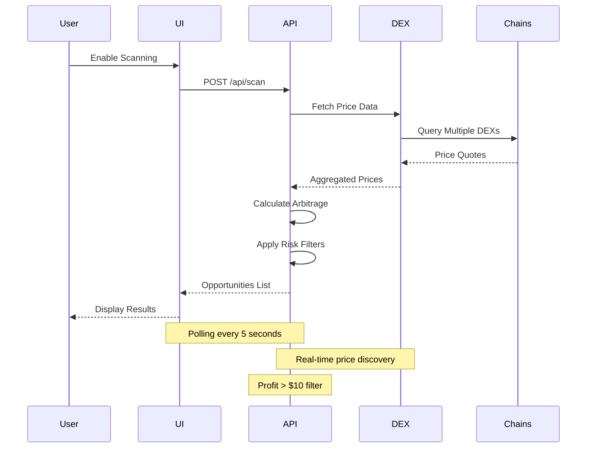

### 2. Simulation Flow

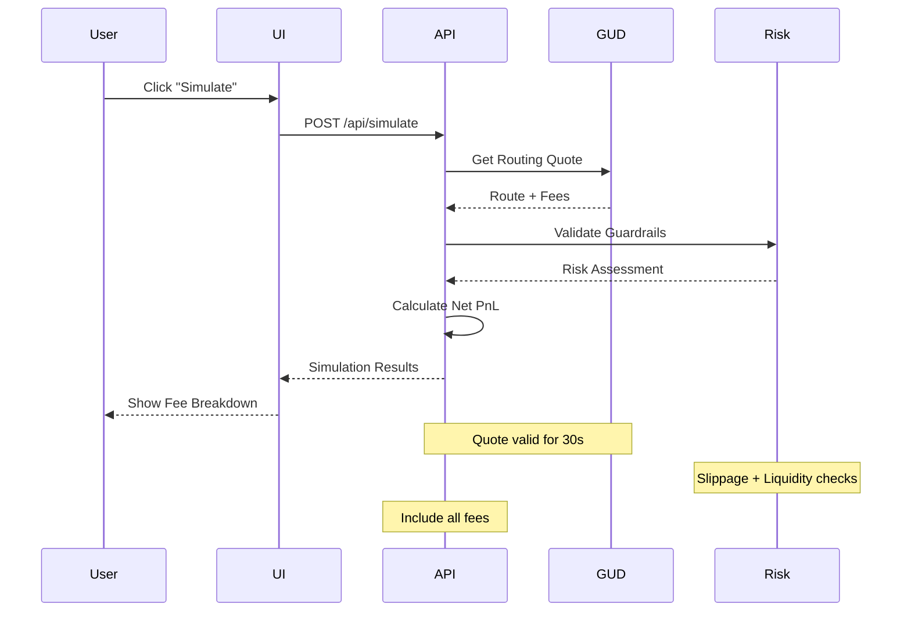

### 3. Execution Flow

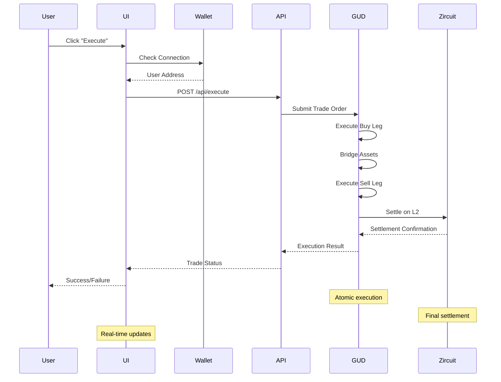

## 🌐 Cross-Chain Trading Architecture

### Multi-Chain Integration Pattern

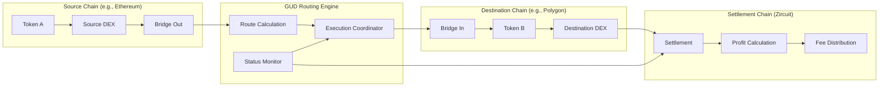

## 🛡️ Risk Management Flow

### Guardrail System

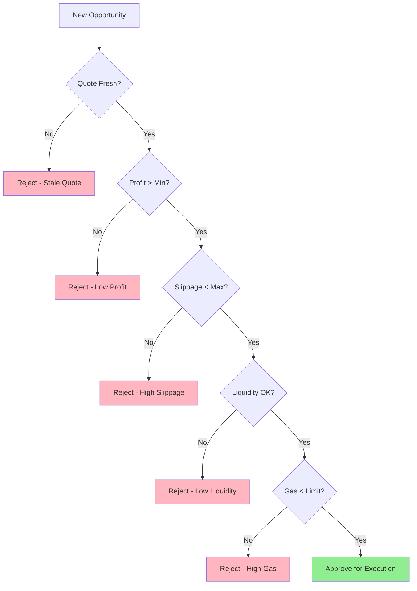

### Risk Assessment Matrix

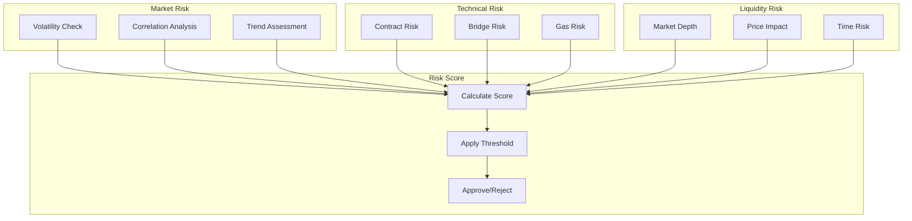

## 💰 Fee Calculation Flow

### Comprehensive Fee Model

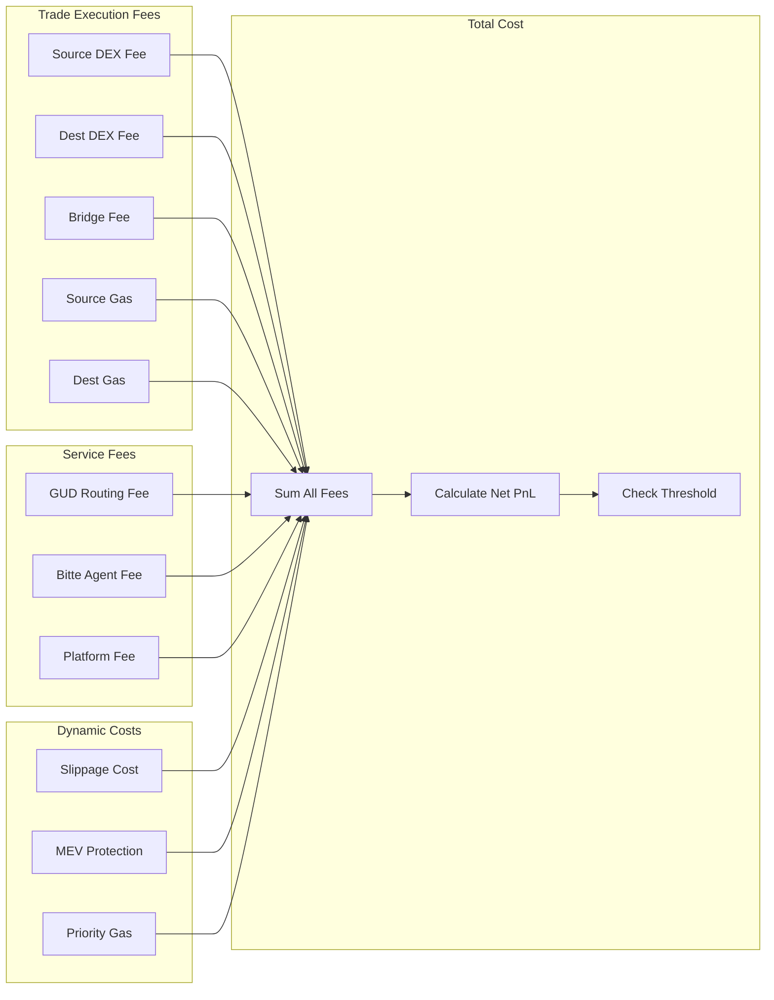

## 🔧 Configuration Management

### Settings Flow

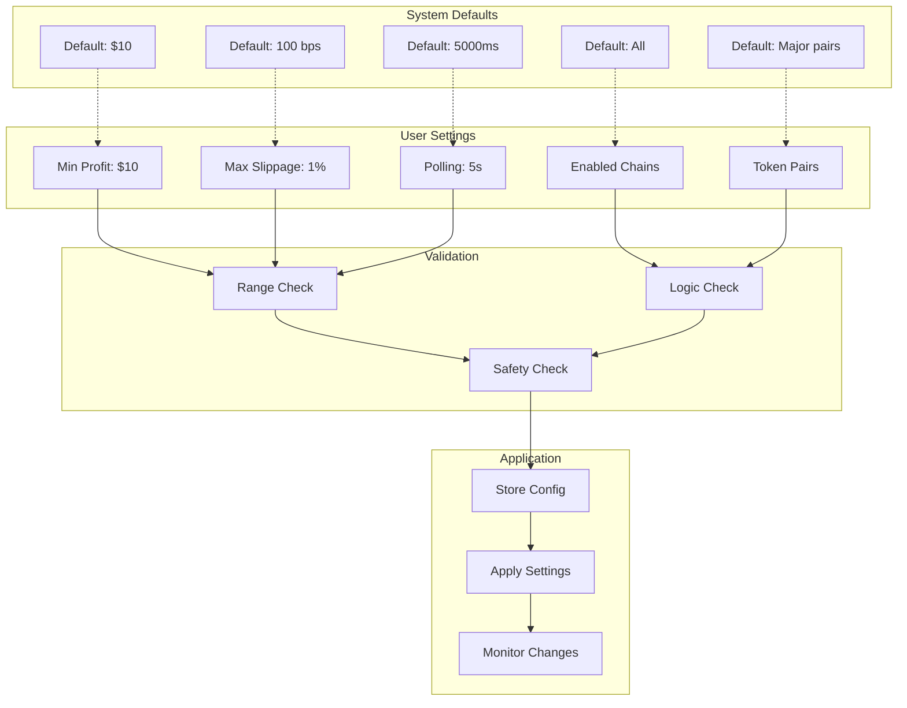

## 📱 User Interface Flow

### Dashboard Interaction Model

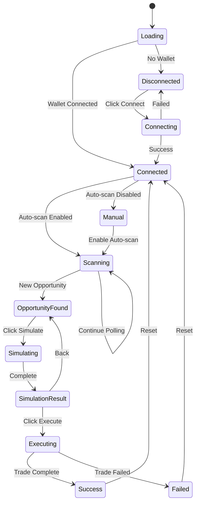

### Component Hierarchy

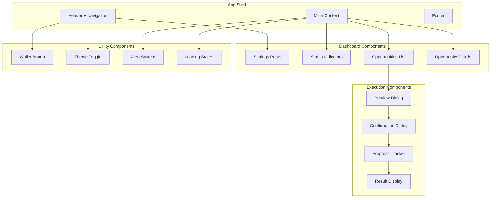

## 🔄 State Management Flow

### Application State

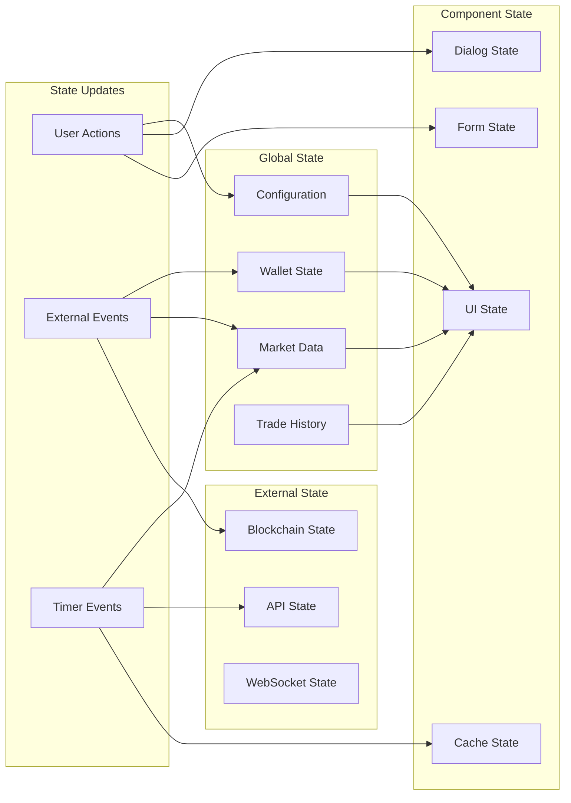

## 🚀 Deployment Architecture

### Production Infrastructure

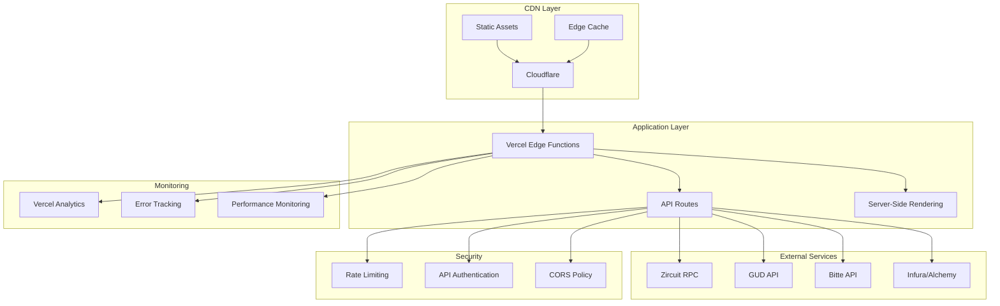

## 🔍 Error Handling Flow

### Error Recovery System

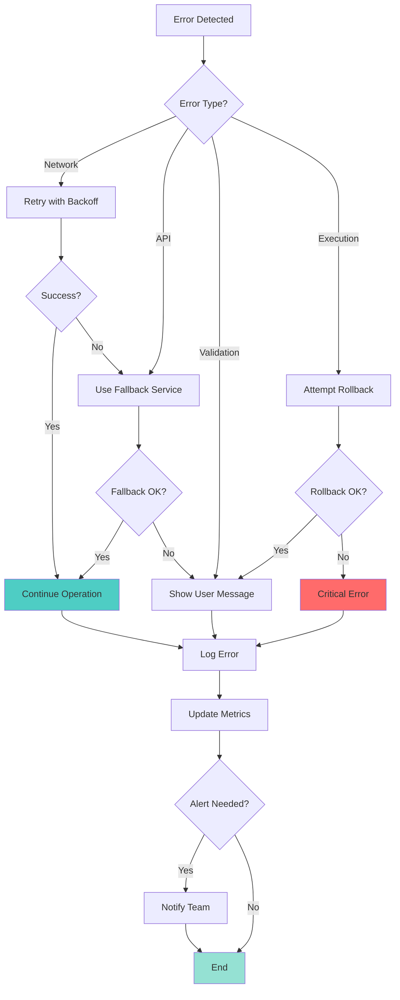

## 📊 Performance Optimization

### Optimization Strategy

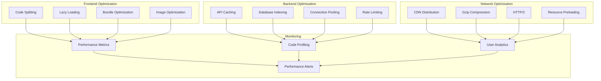

## 🔐 Security Architecture

### Security Layers

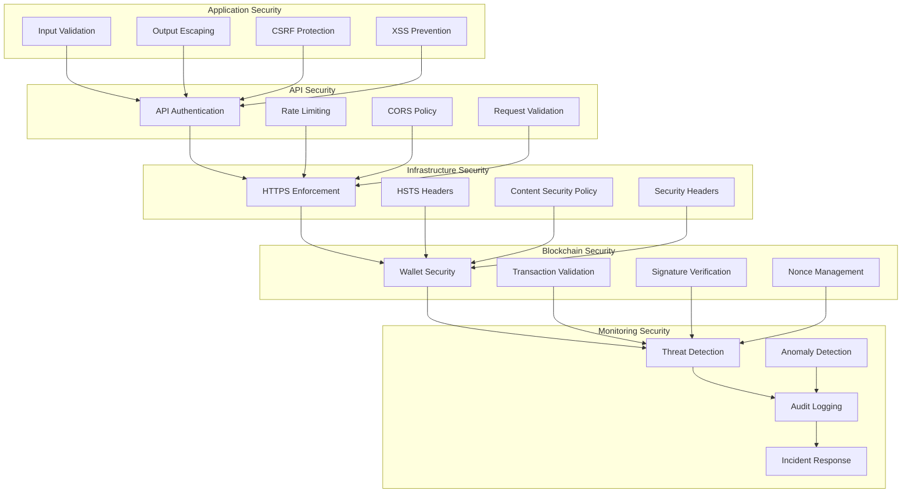

---

## 📋 Flow Summary

This document provides comprehensive visual documentation of ArbiZirQ's architecture and operational flows. Each diagram represents a critical aspect of the system:

1. **System Architecture**: High-level component organization
2. **Core Flows**: Market scanning, simulation, and execution
3. **Cross-Chain Integration**: Multi-blockchain trading patterns
4. **Risk Management**: Guardrail systems and safety checks
5. **Fee Calculation**: Comprehensive cost modeling
6. **Configuration**: Settings and parameter management
7. **User Interface**: Component hierarchy and state management
8. **Deployment**: Production infrastructure and security
9. **Error Handling**: Recovery and resilience patterns
10. **Performance**: Optimization strategies and monitoring

These flows ensure ArbiZirQ operates as a robust, secure, and efficient cross-chain arbitrage platform while maintaining excellent user experience and system reliability.

---

**📝 Note**: All diagrams use Mermaid syntax for easy rendering in GitHub, GitLab, and documentation platforms that support Mermaid visualization.
