# ArbiZirQ — Flow Diagrams & Architecture

> **Essential visual documentation of ArbiZirQ's core arbitrage execution flows and system architecture.**

## 📊 System Architecture Overview


    SIM_API --> ARB_SVC
    EXECUTE_API --> ARB_SVC
    
    ARB_SVC --> GUD
    ARB_SVC --> BITTE
    ARB_SVC --> ZIRCUIT
    
    GUD --> BRIDGE
    BRIDGE --> ETH
    BRIDGE --> POLY
    BRIDGE --> ARB_NET
    BRIDGE --> OPT
    BRIDGE --> ZIR
```

## 🔄 Core Arbitrage Execution Flow

### Complete User Journey: Scan → Simulate → Execute

```mermaid
sequenceDiagram
    participant User
    participant UI
    participant API
    participant GUD
    participant Zircuit
    
    Note over User,Zircuit: 1. Market Scanning Phase
    User->>UI: Enable Auto-scan
    UI->>API: POST /api/scan
    API->>API: Check Multiple DEXs
    API->>API: Calculate Arbitrage Opportunities
    API-->>UI: Return Profitable Opportunities
    UI-->>User: Display Opportunities List
    
    Note over User,Zircuit: 2. AI-Powered Simulation Phase (Bitte + GUD)
    User->>UI: Click "Simulate" on Opportunity
    UI->>API: POST /api/simulate
    API->>GUD: Request Optimal Route + Quote
    Note over GUD: GUD Engine Analysis:<br/>• Multi-path routing<br/>• Bridge cost comparison<br/>• Liquidity depth check<br/>• Gas optimization
    GUD-->>API: Optimized Route + Detailed Fees
    API->>API: Bitte AI Risk Assessment
    Note over API: Bitte AI Analysis:<br/>• Market volatility check<br/>• Success probability<br/>• Risk/reward ratio<br/>• Timing optimization
    API->>API: Calculate Net PnL with All Fees
    API-->>UI: AI-Enhanced Simulation Results
    UI-->>User: Show Detailed Analysis + AI Insights
    
    Note over User,Zircuit: 3. Intelligent Execution Phase (GUD + Bitte Coordination)
    User->>UI: Click "Execute" (if AI recommends)
    UI->>UI: Check Wallet Connection
    UI->>API: POST /api/execute (with userAddress)
    API->>GUD: Submit Optimized Trade Order
    Note over GUD: GUD Atomic Execution:<br/>• Source chain swap<br/>• Bridge coordination<br/>• Destination chain swap<br/>• MEV protection
    GUD->>GUD: Execute Cross-chain Arbitrage
    GUD->>Zircuit: Settle Final Results + Fees
    Zircuit-->>GUD: Settlement Confirmation
    GUD-->>API: Trade Completion Status
    API->>API: Bitte Performance Tracking
    Note over API: Bitte Learning:<br/>• Record success/failure<br/>• Update AI models<br/>• Optimize parameters<br/>• Report metrics
    API-->>UI: Execution Results + AI Analysis
    UI-->>User: Display Final Results + Performance Data
    
    Note over User,Zircuit: Real-time updates throughout
```



## 🌐 Cross-Chain Trading Architecture

### GUD Trading Engine Integration & Execution Flow

```mermaid
graph LR
    subgraph "Source Chain (e.g., Ethereum)"
        SDEX[Source DEX<br/>Uniswap V3]
        STOKEN[Token A<br/>WETH]
        SBRIDGE[Bridge Selection<br/>GUD Chooses Optimal]
    end
    
    subgraph "GUD Trading Engine Core"
        ROUTE[🧠 Route Calculation<br/>• Multi-path analysis<br/>• Gas optimization<br/>• Liquidity assessment]
        BRIDGE_OPT[🌉 Bridge Optimization<br/>• Stargate vs Hop vs Across<br/>• Cost/speed analysis<br/>• Atomic coordination]
        EXEC[⚡ Execution Coordinator<br/>• Transaction batching<br/>• MEV protection<br/>• Slippage management]
        MONITOR[📊 Status Monitor<br/>• Real-time tracking<br/>• Failure detection<br/>• Recovery mechanisms]
    end
    
    subgraph "Destination Chain (e.g., Polygon)"
        DBRIDGE[Bridge Receiver<br/>GUD Coordinated]
        DTOKEN[Token B<br/>USDC]
        DDEX[Destination DEX<br/>QuickSwap]
    end
    
    subgraph "Settlement Chain (Zircuit)"
        SETTLE[💰 Settlement<br/>• Profit calculation<br/>• Fee distribution<br/>• Final confirmation]
        PROFIT[📈 PnL Analysis<br/>• Net profit after fees<br/>• Performance metrics]
        FEES[💸 Fee Breakdown<br/>• GUD routing fees<br/>• Bridge costs<br/>• Gas optimization]
    end
    
    STOKEN --> SDEX
    SDEX --> SBRIDGE
    SBRIDGE --> ROUTE
    ROUTE --> BRIDGE_OPT
    BRIDGE_OPT --> EXEC
    EXEC --> DBRIDGE
    DBRIDGE --> DTOKEN
    DTOKEN --> DDEX
    DDEX --> SETTLE
    SETTLE --> PROFIT
    PROFIT --> FEES
    
    MONITOR --> EXEC
    MONITOR --> SETTLE
    MONITOR --> ROUTE
```



### Bitte AI Orchestration & Decision Making Flow


## 🛡️ Risk Management & Guardrail System

### Safety Checks Before Execution


---

## � Flow Summary

This document provides the 3 most essential visual flows for understanding ArbiZirQ:

1. **System Architecture**: High-level component organization showing how frontend, API, services, and external integrations work together
2. **Core Arbitrage Flow**: Complete user journey from market scanning through simulation to final execution
3. **Risk Management**: Safety guardrails that protect users from unprofitable or risky trades

These flows ensure ArbiZirQ operates as a robust, secure, and efficient cross-chain arbitrage platform while maintaining excellent user experience and system reliability.

---

**📝 Note**: All diagrams use Mermaid syntax for easy rendering in GitHub, GitLab, and documentation platforms that support Mermaid visualization.
