# ArbiZirQ — Flow Diagrams & Architecture

> **Essential visual documentation of ArbiZirQ's core arbitrage execution flows and system architecture.**

## 📊 System Architecture Ove## 📋 Flow Summary

This document provides 3 essential visual flows for understanding ArbiZirQ:

1. **System Architecture**: Shows how frontend, API, services, and integrations work together

2. **Core Arbitrage Flow**: User journey from scanning to execution with:
   - **Bitte AI**: Market analysis and risk assessment
   - **GUD Engine**: Cross-chain routing and execution

3. **Cross-Chain Architecture**: Simple integration between:
   - **Bitte AI System**: Market scanning, risk analysis, performance optimization
   - **GUD Trading Engine**: Route calculation, bridge selection, trade execution
   - **Blockchain Networks**: Ethereum, Polygon, Zircuit settlement

4. **Risk Management**: Simple safety checks to protect users

### 🎯 Key Technology Roles:

**GUD Trading Engine**:
- Cross-chain routing and bridge selection
- Atomic transaction execution
- Gas optimization and MEV protection

**Bitte Open Agents**:
- AI market analysis and opportunity detection
- Automated risk assessment and decision-making
- 24/7 trading operations and continuous learning

These simplified flows show how ArbiZirQ operates as an intelligent, automated arbitrage platform.`mermaid
graph TB
    subgraph "Frontend Layer"
        UI[Next.js UI]
        DASH[Dashboard]
        EXEC[Execute Dialog]
        WALLET[Wallet Connection]
    end
    
    subgraph "API Layer"
        SCAN_API[API Scan]
        SIM_API[API Simulate]
        EXECUTE_API[API Execute]
        HEALTH_API[API Health]
    end
    
    subgraph "Service Layer"
        DEX[DEX Indexer]
        ARB_SVC[Arbitrage Executor]
        RISK[Risk Manager]
        CALC[Fee Calculator]
    end
    
    subgraph "External Integrations"
        GUD[GUD Trading Engine]
        BITTE[Bitte Agents]
        ZIRCUIT[Zircuit L2]
        BRIDGE[Cross-chain Bridges]
    end
    
    subgraph "Blockchain Networks"
        ETH[Ethereum]
        POLY[Polygon]
        ARB_NET[Arbitrum]
        OPT[Optimism]
        ZIR[Zircuit]
    end
    
    UI --> SCAN_API
    UI --> SIM_API
    UI --> EXECUTE_API
    UI --> HEALTH_API
    
    SCAN_API --> DEX
    SIM_API --> ARB_SVC
    EXECUTE_API --> ARB_SVC
    
    ARB_SVC --> GUD
    ARB_SVC --> BITTE
    ARB_SVC --> ZIRCUIT
    
    GUD --> BRIDGE
    BRIDGE --> ETH
    BRIDGE --> POLY
    BRIDGE --> ARB_NET
    BRIDGE --> OPT
    BRIDGE --> ZIR
```
    SIM_API --> ARB_SVC
    EXECUTE_API --> ARB_SVC
    
    ARB_SVC --> GUD
    ARB_SVC --> BITTE
    ARB_SVC --> ZIRCUIT
    
    GUD --> BRIDGE
    BRIDGE --> ETH
    BRIDGE --> POLY
    BRIDGE --> ARB_NET
    BRIDGE --> OPT
    BRIDGE --> ZIR
```

## 🔄 Core Arbitrage Execution Flow

### Complete User Journey: Scan → Simulate → Execute


## 🌐 Cross-Chain Trading Architecture

### Simple GUD + Bitte Integration Flow


## 🛡️ Risk Management & Guardrail System

### Simple Safety Checks

```mermaid
flowchart TD
    START[New Opportunity] --> FRESH{Quote Fresh?}
    FRESH -->|No| REJECT[❌ Reject]
    FRESH -->|Yes| PROFIT{Profit > $10?}
    PROFIT -->|No| REJECT
    PROFIT -->|Yes| SLIP{Slippage < 1%?}
    SLIP -->|No| REJECT
    SLIP -->|Yes| WALLET{Wallet Connected?}
    WALLET -->|No| REJECT
    WALLET -->|Yes| APPROVE[✅ Execute]
    
    style APPROVE fill:#90EE90
    style REJECT fill:#FFB6C1
```



---

## � Flow Summary

This document provides the 3 most essential visual flows for understanding ArbiZirQ:

1. **System Architecture**: High-level component organization showing how frontend, API, services, and external integrations work together
2. **Core Arbitrage Flow**: Complete user journey from market scanning through simulation to final execution
3. **Risk Management**: Safety guardrails that protect users from unprofitable or risky trades

These flows ensure ArbiZirQ operates as a robust, secure, and efficient cross-chain arbitrage platform while maintaining excellent user experience and system reliability.

---

**📝 Note**: All diagrams use Mermaid syntax for easy rendering in GitHub, GitLab, and documentation platforms that support Mermaid visualization.
